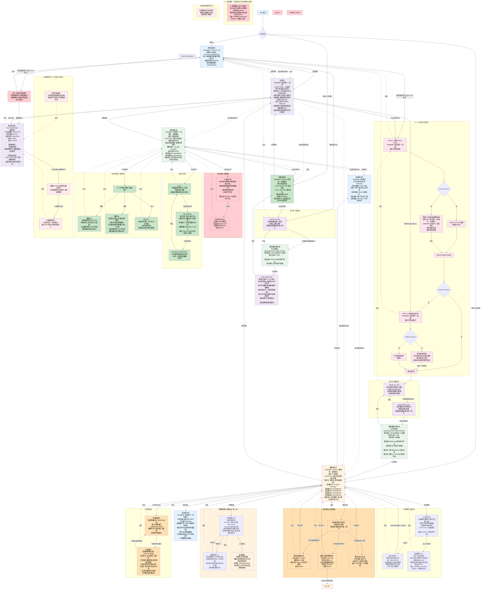

```mermaid
flowchart TD
    %% ==================== App 启动判断 ====================
    APP["App 启动"] --> CHECK{安全检查}
    CHECK -->|未配对| RS
    CHECK -->|已配对+管控端| DEV_SEL
    CHECK -->|已配对+被控端| CDH

    %% ==================== 角色选择页 ====================
    RS["角色选择页<br/>TopAppBar: PeerLock + 设置图标 (无返回)<br/>PeerLock headlineLarge<br/>两人互相监督的屏幕时间管理工具<br/>[我要管控对方] Button<br/>[我需要被管控] OutlinedButton"]
    RS -->|设置图标| SET
    RS -->|我要管控对方| P2_SHOW
    RS -->|我需要被管控 且无ACTIVE配对| DO1
    RS -->|我需要被管控 且有ACTIVE配对| ALREADY_BOUND

    %% ==================== 被控端已绑定提示 ====================
    ALREADY_BOUND["提示: 该设备已被管控<br/>需先解除配对才能重新配对<br/>[去解除配对] 跳转设置-配对信息 [返回]"]
    ALREADY_BOUND -->|去解除配对| PAIR_INFO
    ALREADY_BOUND -->|返回| RS

    %% ==================== DO + 电池优化设置页 ====================
    subgraph DO_SETUP ["DO + 电池优化设置页"]
        DO1["Phase 1: 设置 Device Owner<br/>TopAppBar: 返回箭头 + 标题<br/>返回: 角色选择页"]
        DO_CHECK{"isDeviceOwner?"}
        DO_ALREADY["Device Owner 已设置<br/>[继续] Button"]
        DO_NOT_YET["需要 DO 权限才能限制应用<br/>无线 ADB: 6步说明 + adb命令 + 复制命令<br/>USB ADB: adb命令 + 复制命令<br/>[检查设置状态]<br/>[跳过功能受限]"]
        DO_ADVANCE["advanceToDoComplete"]
        DO_BATTERY_CHECK{"isBatteryExempt?"}
        PHASE2_START["Phase 2: 电池优化白名单<br/>TopAppBar: 返回箭头 + 标题<br/>返回: 角色选择页"]
        BO_CHECK{"isBatteryExempt?"}
        BO_DONE["已关闭电池优化<br/>[继续]"]
        BO_NOT["需关闭电池优化<br/>[关闭电池优化] 系统对话框<br/>[检查是否已关闭]<br/>[跳过后台巡检可能不稳定]"]
        DO_TO_PAIRING["进入配对页"]
    end

    %% ==================== 配对页 - 被控端 ====================
    subgraph PAIRING_CONTROLLED ["配对页 (被控端)"]
        P1_SHOW["SHOW_MY_QR:<br/>请让控制方扫描此二维码<br/>QR码 pairRequestQr<br/>[复制配对数据] 剪贴板<br/>[扫描响应码] 相机"]
        P1_SCAN["SCAN_PEER_QR:<br/>请扫描控制方的响应码<br/>[扫描响应码] 相机<br/>[粘贴响应数据] 输入框 + 确认"]
    end

    %% ==================== 被控端配对确认页 ====================
    CTRLLED_CONFIRM["被控端配对确认页<br/>对方设备名: Build.MANUFACTURER+MODEL<br/>身份指纹: SHA256前8位十六进制<br/>配对会话ID: a3f8...<br/>配对时间: 时间戳<br/><br/>确认配对 Button 5s冷却灰色不可点<br/>取消配对 文字按钮 不起眼<br/><br/>确认后: 种子存入Keystore 配对完成<br/>取消后: 回到P1_SHOW 本次回执作废"]

    %% ==================== 配对页 - 管控端 ====================
    subgraph PAIRING_CONTROLLER ["配对页 (管控端)"]
        P2_SHOW["SHOW_MY_QR:<br/>请扫描被控端的二维码<br/>[扫描二维码] 相机<br/>[粘贴配对数据] 输入框 + 确认"]
    end

    %% ==================== 管控端配对确认页 ====================
    CTRL_CONFIRM["管控端配对确认页<br/>对方设备名: Build.MANUFACTURER+MODEL<br/>身份指纹: SHA256前8位十六进制<br/>配对会话ID: a3f8...<br/><br/>确认配对 Button 5s冷却灰色不可点<br/>取消配对 文字按钮 不起眼"]

    %% ==================== 管控端生成回执 ====================
    P2_RESP["SCAN_PEER_QR:<br/>确认后生成3个TOTP种子<br/>此次会话独立 同设备24h内可复用<br/>种子不可删除 直到被控端申请删除<br/>展示回执QR + [复制回执数据]<br/>此QR/字符串可随时在设备选择页<br/>长按设备卡片重新调出<br/><br/>完成后跳转设备选择页"]

    %% ==================== 管控端设备选择页 ====================
    DEV_SEL["设备选择页<br/>TopAppBar: PeerLock 管控端 + 设置图标<br/>已配对设备列表:<br/>  · Galaxy S24 ACTIVE 身份指纹<br/>  · Pixel 7 WAITING 身份指纹<br/>[添加新设备] Button<br/>[设置] IconButton<br/>长按设备卡片: 重新展示回执QR/查看信息"]

    %% ==================== 管控端主页 ====================
    CH["管控端主页<br/>TopAppBar: 返回箭头 + 设备名 + 设置图标<br/>返回: 设备选择页<br/>StatusCard: 已配对 设备名 策略巡检运行中<br/>验证码每秒刷新: 管理码 解锁码<br/>策略列表: com.app1 com.app2<br/>[审批请求] Button<br/>[使用统计] OutlinedButton<br/>[单向控制] OutlinedButton<br/>底部红色: [显示终止码] 需点击进入新页面"]

    %% ==================== 管控端终止码页 ====================
    subgraph CTRL_DESTROY ["终止码页 (管控端)"]
        CD_WARNING["⚠️ 警告信息:<br/>终止码用于解除与被控端的配对关系<br/>使用后被控端的管控将被解除<br/>加密材料将被清除<br/>此操作不可逆<br/><br/>[确认显示] Button 5s冷却灰色不可点"]
        CD_SHOW["实时显示终止码:<br/>6位数字 每30秒刷新<br/>当前设备: Galaxy S24<br/>[复制终止码] Button<br/>[返回] Button"]
    end

    %% ==================== 审批请求页 ====================
    subgraph REQUEST_APPROVAL ["审批请求页"]
        RA_IDLE["IDLE:<br/>扫描被控端的请求二维码<br/>[开始扫描] 相机<br/>[粘贴请求数据] 输入框+确认"]
        RA_REVIEW["REVIEWING:<br/>请求详情: 类型 应用 时长<br/>设备状态: 屏幕时间 已暂停数<br/>附带统计: 今日使用图表 (如有)<br/>调整参数: 时长Slider 5-180分<br/>模式 FilterChip: 累计/单次<br/>[拒绝] | [批准]"]
        RA_RESP["SHOWING_RESPONSE:<br/>请让被控端扫描此响应码<br/>QR码 + [复制响应数据]<br/>[完成]"]
    end

    %% ==================== 单向控制页 ====================
    subgraph SINGLE_CONTROL ["单向控制页 (管控端)"]
        SC_TAB["三个Tab切换: 解锁 | 调整 | 统计"]
        SC_UNLOCK["解锁Tab:<br/>选择受限应用 FilterChip<br/>解锁时长 5分钟(默认 可配置)<br/>[生成解锁指令] QR/字符串<br/>被控端收到后自动执行"]
        SC_ADJUST["调整Tab:<br/>选择目标应用 或 选择全部策略<br/>新时长/时段/策略配置<br/>可批量修改多项策略打包为一个指令<br/>[生成调整指令] QR/字符串<br/>被控端收到后需确认执行"]
        SC_STATS["统计Tab:<br/>选择时间范围: 1天/7天/30天/全部<br/>[生成请求指令]<br/>被控端自动发送统计数据"]
    end

    %% ==================== 紧急逃生页 (被控端L2入口已移至主页) ====================
    subgraph EMERGENCY ["L2 高级解除 - 在被控端主页申请解除中展开"]
        EM_L2["L2 高级解除 (连点7次展开):<br/>需ADB命令 移除DO和密钥<br/>[开始验证] Button<br/>挑战码红色 [挑战码] 输入框<br/>[验证] Button<br/>通过: ADB命令 monospace<br/>执行后: L2 解除已执行"]
    end

    %% ==================== 被控端主页 ====================
    CDH["被控端主页<br/>TopAppBar: PeerLock 被控端 + 设置图标<br/>返回: 无 顶级页<br/>StatusCard: 已配对 接受控制方管理<br/>管控方: 设备名 (身份指纹摘要)<br/>受限应用: com.app1 com.app2<br/>[使用统计] OutlinedButton<br/>[发送统计] OutlinedButton<br/>[接收指令] OutlinedButton<br/>[管理策略] OutlinedButton<br/>底部红色: [申请解除] 需5s确认后输入终止码"]

    %% ==================== 被控端申请解除 ====================
    subgraph CTRLLED_UNBIND ["申请解除 (被控端)"]
        CU_WARNING["⚠️ 警告信息:<br/>申请解除将解除与管控方的配对关系<br/>管控方的管控将被解除<br/>加密材料将被清除<br/>Device Owner 权限保留<br/><br/>[确认] Button 5s冷却灰色不可点"]
        CU_INPUT["输入终止码:<br/>管控方提供的终止码<br/>6位 TotpInputField<br/>验证通过后立刻执行解绑<br/>清除加密材料 返回主页<br/>提示: 配对已解除"]
        CU_L2_HINT["高级解除 (L2):<br/>连点7次此处展开<br/>需ADB命令 移除DO和密钥<br/>[开始验证] Button<br/>挑战码红色 [挑战码] 输入框<br/>[验证] Button<br/>通过: ADB命令 monospace<br/>执行后: L2 解除已执行"]
    end

    %% ==================== 被控端接收指令页 ====================
    subgraph RECEIVE_CMD ["接收指令页 (被控端)"]
        RC_IDLE["接收控制端主动指令:<br/>[扫描指令] 相机<br/>[粘贴指令数据] 输入框 + 确认"]
        RC_UNLOCK["解析为解锁指令:<br/>目标应用: com.app1<br/>解锁时长: 5分钟<br/>[确认执行] Button 自动执行解锁<br/>[拒绝] Button"]
        RC_ADJUST["解析为调整/策略指令:<br/>目标应用: com.app1<br/>新时长/时段: xxx<br/>或 批量策略配置变更<br/>[确认执行] Button<br/>[拒绝] Button"]
        RC_STATS["解析为统计请求:<br/>时间范围: 最近7天<br/>自动执行: 生成统计报告<br/>展示 QR/字符串 + [复制数据]"]
    end

    %% ==================== 被控端策略管理页 ====================
    subgraph CONTROLLED_POLICY ["策略管理页 (被控端) - 两个Tab"]
        CP_TAB_APP["应用策略 Tab:<br/>当前策略列表:<br/>com.app1 每日30分钟 09:00-22:00<br/>com.app2 每日60分钟<br/>每项策略右侧 [修改] 按钮<br/>修改需管理码验证 或生成配置变更请求"]
        CP_TAB_CONFIG["配置参数 Tab:<br/>默认解锁时长: 5分钟(可调)<br/>申请模式默认时长: 5分钟(可调)<br/>统计默认附带范围: 最近1天(可调)<br/>修改需管理码验证"]
        CP_EDIT["修改策略:<br/>调整时长/时段参数<br/>需输入管理码验证 或 生成配置变更请求<br/>管理码: 6位TotpInputField<br/>生成请求: QR/字符串 发给控制端审批"]
    end

    %% ==================== 申请解锁页 ====================
    subgraph UNLOCK_REQUEST ["申请解锁页"]
        UR_QUICK["快速码模式:<br/>选择受限应用 FilterChip (必选)<br/>输入6位解锁码<br/>[6位TotpInputField]<br/>解锁时长 5分钟(默认 可配置)<br/>[切换到申请模式]"]
        UR_REQUEST["申请模式:<br/>选择要解锁的应用 FilterChip (必选)<br/>请求时长 5分钟(默认 可配置)<br/>☐ 附带统计数据(默认附带范围可配置)<br/>[生成申请码] 需选中应用<br/>生成后: 请让控制方扫描 QR码<br/>[复制申请数据] 剪贴板<br/>[切换到快速码模式]"]
    end

    %% ==================== 使用统计页 ====================
    ST["使用统计页<br/>TopAppBar: 返回箭头<br/>[今天] [本周] [本月] FilterChip<br/>小时柱状图 Canvas 今天:<br/>X轴 0-23时 Y轴 分钟 点击下钻<br/>日折线图 Canvas 本周/本月:<br/>X轴 日期 Y轴 分钟 点击下钻<br/>应用明细: com.app1 120分 启动8次"]

    %% ==================== 发送统计页 ====================
    PUSH_STATS["发送统计页<br/>TopAppBar: 返回箭头 + 发送统计<br/>时间范围: 最近1天/7天/30天/全部 FilterChip<br/>数据量大时: QR不可承载则切换为<br/>加密文件导出(同现有传输加密)<br/>预览: 统计数据摘要<br/>[生成统计报告] QR/字符串/文件<br/>[复制数据] 剪贴板"]

    %% ==================== 设置页 ====================
    SET["设置页<br/>TopAppBar: 返回箭头 + 设置<br/>Device Owner: ✓已设置(灰)/✗未设置(可点击)<br/>电池优化: ✓已关闭(灰)/✗未关闭(可点击)<br/>[配对信息] 点击进入详情页<br/>主题模式: [跟随系统] [浅色] [深色] FilterChip<br/>语言: [中文] [English] FilterChip<br/>[切换角色] 回角色选择页(原配置保持运行)<br/>[身份重置] 条件满足时可用 10s确认"]

    %% ==================== 配对信息页 ====================
    PAIR_INFO["配对信息页 (FLAG_SECURE)<br/>当前配对:<br/>  对方设备名: Galaxy S24<br/>  身份指纹: B7:1E:...<br/>  配对时间: 2026-05-02<br/>  会话ID: a3f8-...<br/>  状态: ACTIVE<br/><br/>管控端操作:<br/>  [查看验证码]<br/>  [申请删除种子] 被控端确认后可操作<br/><br/>历史配对记录:<br/>  · Pixel 7 REVOKED 可申请删除种子<br/>  · [归档记录] 查看已归档会话"]

    %% ==================== 申请删除种子 (被控端) ====================
    subgraph SEED_DELETE ["申请删除种子 - 历史配对记录中"]
        SD_INFO["仅限REVOKED或等待状态的会话<br/>正在被管控的无法操作 只能申请解除"]
        SD_GEN["生成删除请求:<br/>包含会话ID + 身份签名<br/>展示 QR/字符串 发送给管控方"]
        SD_ARCHIVE["管控方删除后:<br/>可选择归档隐藏该会话记录<br/>归档后仍可查看 仍可发删除申请"]
    end

    %% ==================== 管控端接收删除申请 ====================
    subgraph CTRL_SEED_DEL ["管控端收到删除申请"]
        CSD_AUTO["自动删除对应会话种子<br/>移除该设备配对记录<br/>通知告知 已删除"]
    end

    %% ==================== 初始化流程: DO设置内部 ====================
    DO1 --> DO_CHECK
    DO_CHECK -->|是| DO_ALREADY
    DO_CHECK -->|否| DO_NOT_YET
    DO_ALREADY --> DO_ADVANCE
    DO_NOT_YET -->|跳过| DO_ADVANCE
    DO_ADVANCE --> DO_BATTERY_CHECK
    DO_BATTERY_CHECK -->|是| DO_TO_PAIRING
    DO_BATTERY_CHECK -->|否| PHASE2_START
    PHASE2_START --> BO_CHECK
    BO_CHECK -->|是| BO_DONE
    BO_CHECK -->|否| BO_NOT
    BO_NOT -->|跳过 / 关闭成功| DO_TO_PAIRING
    BO_DONE --> DO_TO_PAIRING
    DO_TO_PAIRING --> P1_SHOW

    %% ==================== 初始化流程: 配对(被控端) ====================
    DO1 -.->|返回| RS
    PHASE2_START -.->|返回| RS
    P1_SHOW -.->|返回| DO1
    P1_SCAN -.->|返回| P1_SHOW
    P1_SHOW -->|扫描或粘贴响应码| P1_SCAN
    P1_SCAN -->|回执验证通过| CTRLLED_CONFIRM
    CTRLLED_CONFIRM -->|5s后确认| CDH
    CTRLLED_CONFIRM -->|取消| P1_SHOW

    %% ==================== 初始化流程: 配对(管控端) ====================
    P2_SHOW -.->|返回| RS
    P2_SHOW -->|扫描或粘贴被控端QR| CTRL_CONFIRM
    CTRL_CONFIRM -->|5s后确认| P2_RESP
    CTRL_CONFIRM -->|取消| P2_SHOW
    P2_RESP -->|完成| DEV_SEL

    %% ==================== 设备选择页 流转 ====================
    DEV_SEL -->|点击设备卡片| CH
    DEV_SEL -->|添加新设备| P2_SHOW
    DEV_SEL -->|设置图标| SET
    CH -.->|返回| DEV_SEL

    %% ==================== 管控端主页 流转 ====================
    CH -->|审批请求| RA_IDLE
    CH -->|显示终止码| CD_WARNING
    CH -->|使用统计| ST
    CH -->|单向控制| SC_TAB
    CH -->|设置图标| SET

    %% ==================== 审批请求页 ====================
    RA_IDLE -.->|返回| CH
    RA_IDLE -->|扫描/粘贴请求| RA_REVIEW
    RA_REVIEW -->|批准或拒绝| RA_RESP
    RA_RESP -->|完成| RA_IDLE

    %% ==================== 单向控制页 ====================
    SC_TAB -->|解锁| SC_UNLOCK
    SC_TAB -->|调整| SC_ADJUST
    SC_TAB -->|统计| SC_STATS
    SC_UNLOCK -.->|返回| CH
    SC_ADJUST -.->|返回| CH
    SC_STATS -.->|返回| CH

    %% ==================== 管控端终止码页 ====================
    CD_WARNING -->|5s确认| CD_SHOW
    CD_SHOW -.->|返回| CH

    %% ==================== 被控端主页 流转 ====================
    CDH -->|点击应用卡片| UR_QUICK
    CDH -->|使用统计| ST
    CDH -->|发送统计| PUSH_STATS
    CDH -->|接收指令| RC_IDLE
    CDH -->|管理策略| CP_TAB_APP
    CDH -->|申请解除| CU_WARNING
    CDH -->|设置图标| SET

    %% ==================== 接收指令页 内部 ====================
    RC_IDLE -.->|返回| CDH
    RC_IDLE -->|扫描/粘贴解锁指令| RC_UNLOCK
    RC_IDLE -->|扫描/粘贴调整指令| RC_ADJUST
    RC_IDLE -->|扫描/粘贴统计请求| RC_STATS
    RC_UNLOCK -->|确认执行| CDH
    RC_UNLOCK -.->|拒绝| CDH
    RC_ADJUST -->|确认执行| CDH
    RC_ADJUST -.->|拒绝| CDH
    RC_STATS -->|生成报告| CDH

    %% ==================== 被控端策略管理页 内部 ====================
    CP_TAB_APP -.->|返回| CDH
    CP_TAB_APP -->|点击修改| CP_EDIT
    CP_TAB_APP -->|切换Tab| CP_TAB_CONFIG
    CP_TAB_CONFIG -->|切换Tab| CP_TAB_APP
    CP_TAB_CONFIG -.->|返回| CDH
    CP_EDIT -.->|返回| CP_TAB_APP

    %% ==================== 接收指令-策略修改关联 ====================
    RC_ADJUST -->|确认执行策略变更| CP_LIST

    %% ==================== 申请解锁页 ====================
    UR_QUICK -.->|返回| CDH
    UR_REQUEST -.->|返回| CDH
    UR_QUICK -->|切换到申请模式| UR_REQUEST
    UR_REQUEST -->|切换到快速码模式| UR_QUICK

    %% ==================== 发送统计页 ====================
    PUSH_STATS -.->|返回| CDH

    %% ==================== 使用统计页 ====================
    ST -.->|返回管控端主页| CH
    ST -.->|返回被控端主页| CDH

    %% ==================== 设置页 流转 ====================
    SET -.->|返回角色选择页| RS
    SET -.->|返回管控端主页| CH
    SET -.->|返回被控端主页| CDH
    SET -.->|返回设备选择页| DEV_SEL
    SET -->|DO未设置点击| DO1
    SET -->|电池优化未关闭点击| PHASE2_START
    SET -->|配对信息| PAIR_INFO
    SET -->|切换角色| RS

    %% ==================== 配对信息页 ====================
    PAIR_INFO -.->|返回| SET
    PAIR_INFO -->|历史记录申请删除种子| SD_INFO

    %% ==================== 被控端申请解除流程 ====================
    CU_WARNING -->|5s确认| CU_INPUT
    CU_WARNING -->|连点7次展开| CU_L2_HINT
    CU_INPUT -->|终止码验证通过 立刻执行| CDH
    CU_INPUT -.->|取消| CDH
    CU_L2_HINT -.->|返回| CDH

    %% ==================== 申请删除种子流程 ====================
    SD_INFO -->|生成删除请求| SD_GEN
    SD_GEN -.->|返回| PAIR_INFO
    SD_ARCHIVE -.->|返回| PAIR_INFO

    %% ==================== 配置策略页 ====================
    POLICY_CONFIG -.->|返回| SET

    %% ==================== 样式 ====================
    style APP fill:#E3F2FD,color:#000
    style RS fill:#E3F2FD,color:#000
    style ALREADY_BOUND fill:#FFCDD2,color:#000
    style DO1 fill:#FCE4EC,color:#000
    style DO_ALREADY fill:#FCE4EC,color:#000
    style DO_NOT_YET fill:#FCE4EC,color:#000
    style DO_ADVANCE fill:#FCE4EC,color:#000
    style PHASE2_START fill:#FCE4EC,color:#000
    style BO_DONE fill:#FCE4EC,color:#000
    style BO_NOT fill:#FCE4EC,color:#000
    style DO_TO_PAIRING fill:#FCE4EC,color:#000
    style P1_SHOW fill:#F3E5F5,color:#000
    style P1_SCAN fill:#F3E5F5,color:#000
    style CTRLLED_CONFIRM fill:#E8F5E9,color:#000
    style P2_SHOW fill:#F3E5F5,color:#000
    style CTRL_CONFIRM fill:#E8F5E9,color:#000
    style P2_RESP fill:#F3E5F5,color:#000
    style DEV_SEL fill:#C8E6C9,color:#000
    style CH fill:#E8F5E9,color:#000
    style CTRL_DESTROY fill:#FFCDD2,color:#000
    style CD_WARNING fill:#FFCDD2,color:#000
    style CD_SHOW fill:#FFCDD2,color:#000
    style RA_IDLE fill:#C8E6C9,color:#000
    style RA_REVIEW fill:#C8E6C9,color:#000
    style RA_RESP fill:#C8E6C9,color:#000
    style SC_TAB fill:#C8E6C9,color:#000
    style SC_UNLOCK fill:#C8E6C9,color:#000
    style SC_ADJUST fill:#C8E6C9,color:#000
    style SC_STATS fill:#C8E6C9,color:#000
    style EM_L1 fill:#FFCDD2,color:#000
    style EM_L2 fill:#FFCDD2,color:#000
    style CDH fill:#FFF3E0,color:#000
    style UR_QUICK fill:#FFE0B2,color:#000
    style UR_REQUEST fill:#FFE0B2,color:#000
    style PUSH_STATS fill:#E3F2FD,color:#000
    style UNBIND_INPUT fill:#FFCDD2,color:#000
    style SD_INFO fill:#FFEBEE,color:#000
    style SD_GEN fill:#FFEBEE,color:#000
    style SD_ARCHIVE fill:#FFEBEE,color:#000
    style CSD_AUTO fill:#FFEBEE,color:#000
    style ST fill:#E3F2FD,color:#000
    style SET fill:#EDE7F6,color:#000
    style PAIR_INFO fill:#EDE7F6,color:#000
    style POLICY_CONFIG fill:#EDE7F6,color:#000
    style RECEIVE_CMD fill:#FFE0B2,color:#000
    style RC_IDLE fill:#FFE0B2,color:#000
    style RC_UNLOCK fill:#FFE0B2,color:#000
    style RC_ADJUST fill:#FFE0B2,color:#000
    style RC_STATS fill:#FFE0B2,color:#000
    style CONTROLLED_POLICY fill:#FFF3E0,color:#000
    style CP_LIST fill:#FFF3E0,color:#000
    style CP_EDIT fill:#FFF3E0,color:#000
```
