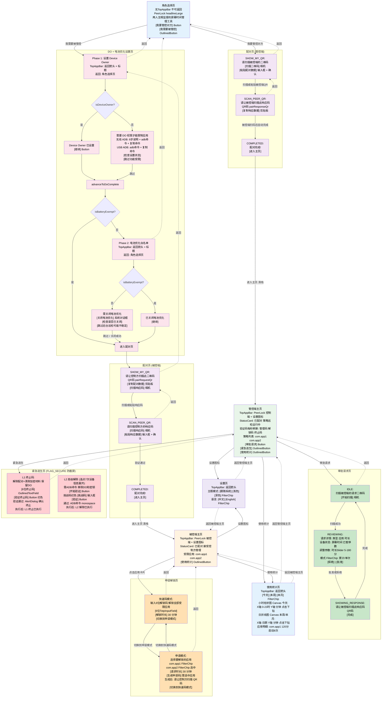

```mermaid
flowchart TD
    %% 角色选择
    RS["角色选择页<br/>无TopAppBar 不可返回<br/>PeerLock headlineLarge<br/>两人互相监督的屏幕时间管理工具<br/>[我要管控对方] Button<br/>[我需要被管控] OutlinedButton"]

    %% DO 设置 Phase1
    subgraph DO_SETUP ["DO + 电池优化设置页"]
        DO1["Phase 1: 设置 Device Owner<br/>TopAppBar: 返回箭头 + 标题<br/>返回: 角色选择页"]
        DO_CHECK{"isDeviceOwner?"}
        DO_ALREADY["Device Owner 已设置<br/>[继续] Button"]
        DO_NOT_YET["需要 DO 权限才能限制应用<br/>无线 ADB: 6步说明 + adb命令 + 复制命令<br/>USB ADB: adb命令 + 复制命令<br/>[检查设置状态]<br/>[跳过功能受限]"]
        DO_ADVANCE["advanceToDoComplete"]
        DO_BATTERY_CHECK{"isBatteryExempt?"}
        PHASE2_START["Phase 2: 电池优化白名单<br/>TopAppBar: 返回箭头 + 标题<br/>返回: 角色选择页"]
        BO_CHECK{"isBatteryExempt?"}
        BO_DONE["已关闭电池优化<br/>[继续]"]
        BO_NOT["需关闭电池优化<br/>[关闭电池优化] 系统对话框<br/>[检查是否已关闭]<br/>[跳过后台巡检可能不稳定]"]
        DO_TO_PAIRING["进入配对页"]
    end

    %% 配对页 - 被控端
    subgraph PAIRING_CONTROLLED ["配对页 (被控端)"]
        P1_SHOW["SHOW_MY_QR:<br/>请让控制方扫描此二维码<br/>QR码 pairRequestQr<br/>[复制配对数据] 剪贴板<br/>[扫描响应码] 相机"]
        P1_SCAN["SCAN_PEER_QR:<br/>请扫描控制方的响应码<br/>[扫描响应码] 相机<br/>[粘贴响应数据] 输入框 + 确认"]
        P1_DONE["COMPLETED:<br/>配对完成!<br/>[进入主页]"]
    end

    %% 配对页 - 管控端
    subgraph PAIRING_CONTROLLER ["配对页 (管控端)"]
        P2_SHOW["SHOW_MY_QR:<br/>请扫描被控端的二维码<br/>[扫描二维码] 相机<br/>[粘贴配对数据] 输入框 + 确认"]
        P2_RESP["SCAN_PEER_QR:<br/>请让被控端扫描此响应码<br/>QR码 pairResponseQr<br/>[复制响应数据] 剪贴板"]
        P2_DONE["COMPLETED:<br/>配对完成!<br/>[进入主页]"]
    end

    %% 管控端主页
    CH["管控端主页<br/>TopAppBar: PeerLock 控制端 + 设置图标<br/>StatusCard: 已配对 策略巡检运行中<br/>验证码每秒刷新: 管理码 解锁码 终止码<br/>策略列表: com.app1 com.app2<br/>[审批请求] Button<br/>[紧急逃生] OutlinedButton<br/>[使用统计] OutlinedButton"]

    %% 审批请求页
    subgraph REQUEST_APPROVAL ["审批请求页"]
        RA_IDLE["IDLE:<br/>扫描被控端的请求二维码<br/>[开始扫描] 相机"]
        RA_REVIEW["REVIEWING:<br/>请求详情: 类型 应用 时长<br/>设备状态: 屏幕时间 已暂停数<br/>调整参数: 时长Slider 5-180分<br/>模式 FilterChip: 累计/单次<br/>[拒绝] | [批准]"]
        RA_RESP["SHOWING_RESPONSE:<br/>请让被控端扫描此响应码<br/>QR码<br/>[完成]"]
    end

    %% 紧急逃生页
    subgraph EMERGENCY ["紧急逃生页 (FLAG_SECURE 防截屏)"]
        EM_L1["L1 终止码:<br/>解除配对+清除加密材料 保留DO<br/>[6位终止码] OutlinedTextField<br/>[验证终止码] Button 红色<br/>验证通过: AlertDialog 确认终止<br/>执行后: L1 终止已执行"]
        EM_L2["L2 高级解除 (连点7次设备信息展开):<br/>需ADB命令 移除DO和密钥<br/>[开始验证] Button<br/>挑战码红色 [挑战码] 输入框<br/>[验证] Button<br/>通过: ADB命令 monospace<br/>执行后: L2 解除已执行"]
    end

    %% 被控端主页
    CDH["被控端主页<br/>TopAppBar: PeerLock 被控端 + 设置图标<br/>StatusCard: 已配对 接受控制方管理<br/>受限应用: com.app1 com.app2<br/>[使用统计] OutlinedButton"]

    %% 申请解锁页
    subgraph UNLOCK_REQUEST ["申请解锁页"]
        UR_QUICK["快速码模式:<br/>输入6位解锁码 解锁全部受限应用<br/>[6位TotpInputField]<br/>[解锁时长] 30 分钟<br/>[切换到申请模式]"]
        UR_REQUEST["申请模式:<br/>选择要解锁的应用<br/>com.app1 FilterChip<br/>com.app2 FilterChip 选中<br/>[请求时长] 30 分钟<br/>[生成申请码] 需选中应用<br/>生成后: 请让控制方扫描 QR码<br/>[切换到快速码模式]"]
    end

    %% 通用子页
    ST["使用统计页<br/>TopAppBar: 返回箭头<br/>[今天] [本周] [本月] FilterChip<br/>小时柱状图 Canvas 今天:<br/>X轴 0-23时 Y轴 分钟 点击下钻<br/>日折线图 Canvas 本周/本月:<br/>X轴 日期 Y轴 分钟 点击下钻<br/>应用明细: com.app1 120分 启动8次"]
    SET["设置页<br/>TopAppBar: 返回箭头<br/>主题模式: [跟随系统] [浅色] [深色] FilterChip<br/>语言: [中文] [English] FilterChip"]

    %% 连线：角色 -> 配对/DO
    RS -->|我要管控对方| P2_SHOW
    RS -->|我需要被管控| DO1

    %% DO 设置内部
    DO1 --> DO_CHECK
    DO_CHECK -->|是| DO_ALREADY
    DO_CHECK -->|否| DO_NOT_YET
    DO_ALREADY --> DO_ADVANCE
    DO_NOT_YET -->|跳过| DO_ADVANCE
    DO_ADVANCE --> DO_BATTERY_CHECK
    DO_BATTERY_CHECK -->|是| DO_TO_PAIRING
    DO_BATTERY_CHECK -->|否| PHASE2_START
    PHASE2_START --> BO_CHECK
    BO_CHECK -->|是| BO_DONE
    BO_CHECK -->|否| BO_NOT
    BO_NOT -->|跳过 / 关闭成功| DO_TO_PAIRING
    BO_DONE --> DO_TO_PAIRING

    %% DO 结束 -> 配对页(被控端)
    DO_TO_PAIRING --> P1_SHOW

    %% 配对页(被控端) 内部
    P1_SHOW -->|扫描或粘贴响应码| P1_SCAN
    P1_SCAN -->|验证通过| P1_DONE
    P1_DONE -->|进入主页 清栈| CDH

    %% 配对页(管控端) 内部
    P2_SHOW -->|扫描或粘贴被控端QR| P2_RESP
    P2_RESP -->|被控端扫码后自动完成| P2_DONE
    P2_DONE -->|进入主页 清栈| CH

    %% 返回：配对/DO -> 角色
    DO1 -.->|返回| RS
    PHASE2_START -.->|返回| RS
    P1_SHOW -.->|返回| DO1
    P1_SCAN -.->|返回| P1_SHOW
    P2_SHOW -.->|返回| RS
    P2_RESP -.->|返回| P2_SHOW

    %% 管控端主页 流转
    CH -->|设置图标| SET
    CH -->|审批请求| RA_IDLE
    CH -->|紧急逃生| EM_L1
    CH -->|使用统计| ST

    %% 审批请求页 内部
    RA_IDLE -->|扫描成功| RA_REVIEW
    RA_REVIEW -->|批准或拒绝| RA_RESP
    RA_RESP -->|完成| RA_IDLE

    %% 被控端主页 流转
    CDH -->|设置图标| SET
    CDH -->|点击应用卡片| UR_QUICK
    CDH -->|使用统计| ST

    %% 申请解锁页 内部
    UR_QUICK -->|切换到申请模式| UR_REQUEST
    UR_REQUEST -->|切换到快速码模式| UR_QUICK

    %% 返回：子页 -> 主页
    RA_IDLE -.->|返回| CH
    EM_L1 -.->|返回| CH
    UR_QUICK -.->|返回| CDH
    UR_REQUEST -.->|返回| CDH
    ST -.->|返回管控端主页| CH
    ST -.->|返回被控端主页| CDH
    SET -.->|返回管控端主页| CH
    SET -.->|返回被控端主页| CDH

    %% 样式
    style RS fill:#E3F2FD,color:#000
    style DO1 fill:#FCE4EC,color:#000
    style DO_ALREADY fill:#FCE4EC,color:#000
    style DO_NOT_YET fill:#FCE4EC,color:#000
    style DO_ADVANCE fill:#FCE4EC,color:#000
    style PHASE2_START fill:#FCE4EC,color:#000
    style BO_DONE fill:#FCE4EC,color:#000
    style BO_NOT fill:#FCE4EC,color:#000
    style DO_TO_PAIRING fill:#FCE4EC,color:#000
    style P1_SHOW fill:#F3E5F5,color:#000
    style P1_SCAN fill:#F3E5F5,color:#000
    style P1_DONE fill:#F3E5F5,color:#000
    style P2_SHOW fill:#F3E5F5,color:#000
    style P2_RESP fill:#F3E5F5,color:#000
    style P2_DONE fill:#F3E5F5,color:#000
    style CH fill:#E8F5E9,color:#000
    style RA_IDLE fill:#C8E6C9,color:#000
    style RA_REVIEW fill:#C8E6C9,color:#000
    style RA_RESP fill:#C8E6C9,color:#000
    style EM_L1 fill:#FFCDD2,color:#000
    style EM_L2 fill:#FFCDD2,color:#000
    style CDH fill:#FFF3E0,color:#000
    style UR_QUICK fill:#FFE0B2,color:#000
    style UR_REQUEST fill:#FFE0B2,color:#000
    style ST fill:#E3F2FD,color:#000
    style SET fill:#EDE7F6,color:#000
```