# PeerLock UI 导航流程图

> **Version**: 3.0
> **更新日期**: 2026-05-11
> **配合**: [ui-pages-detail.md](ui-pages-detail.md) 详细页面图使用
> **变更**: 多配对设备选择、配对确认流程、申请解绑、单向控制、设置页扩展

---

## 导航架构总图

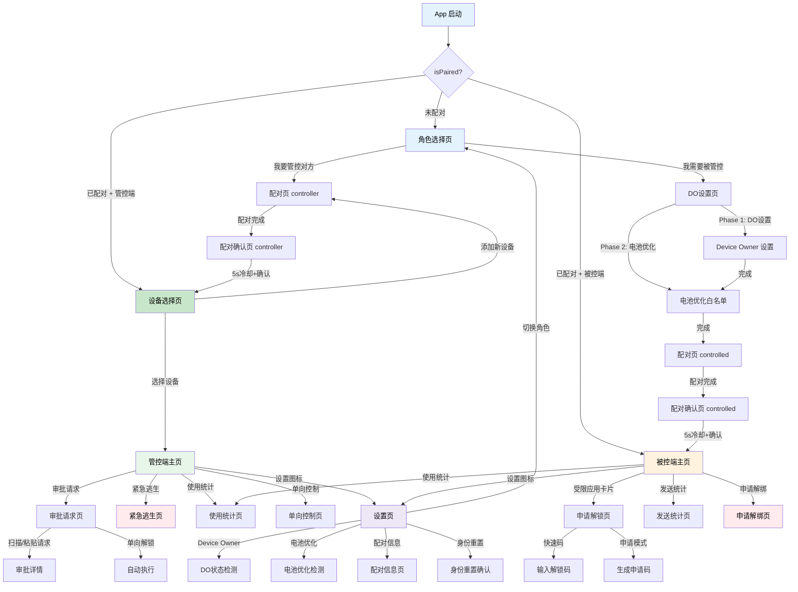

---

## 1. 启动与角色判断

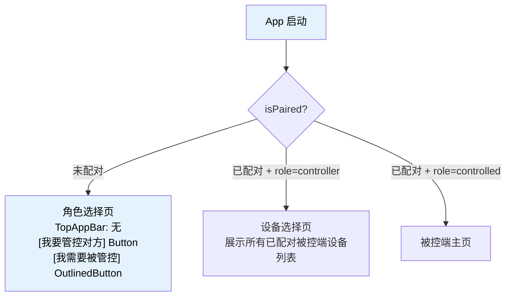

---

## 2. 被控端初始化流程

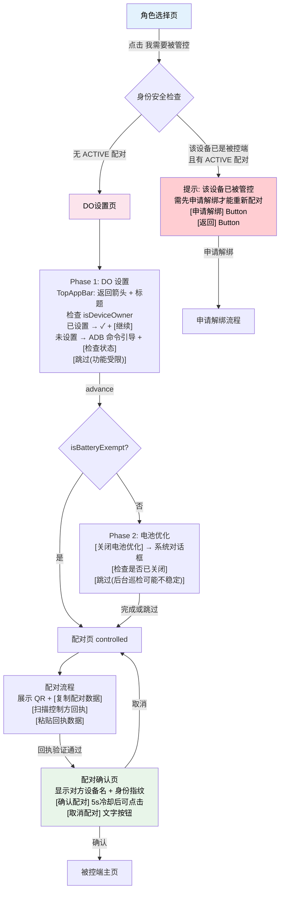

---

## 3. 管控端初始化流程

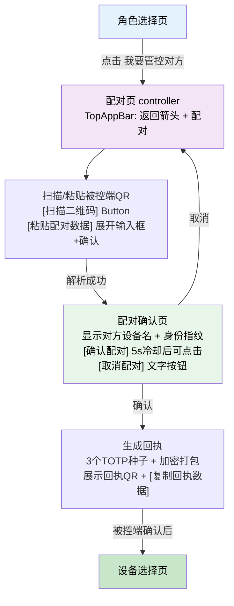

---

## 4. 设备选择页（管控端多配对）

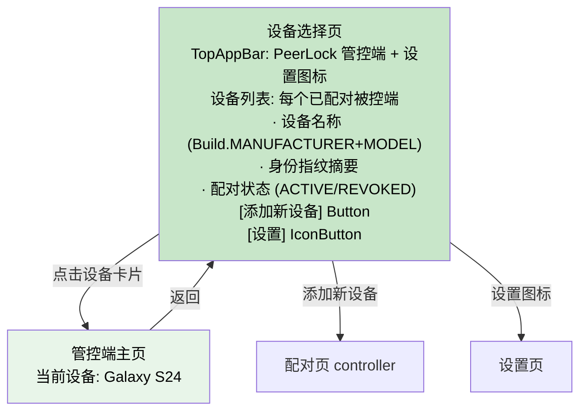

---

## 5. 管控端主页

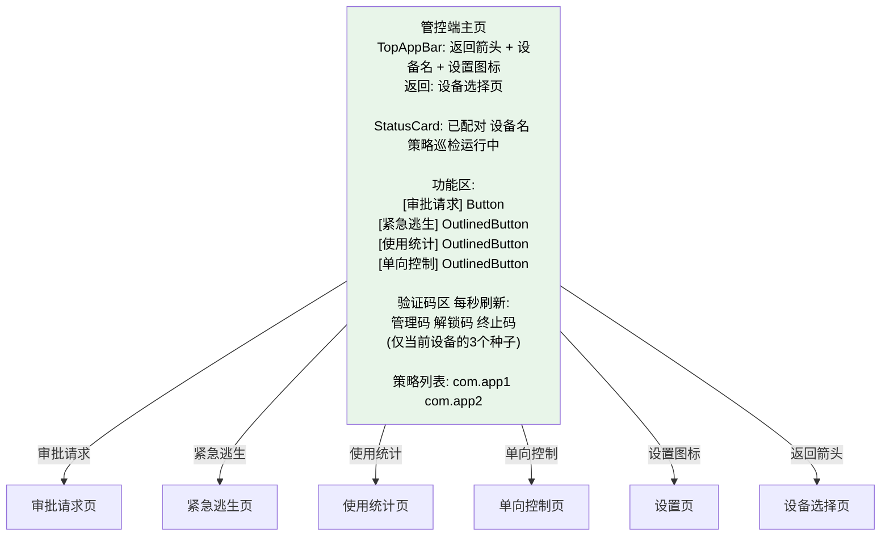

---

## 6. 被控端主页

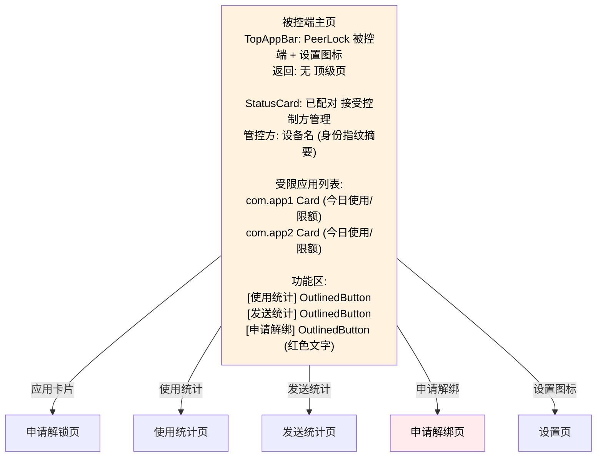

---

## 7. 申请解锁流程（被控端）

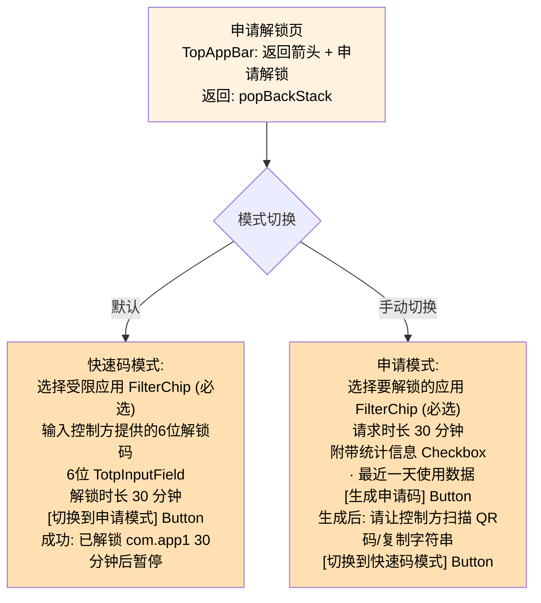

---

## 8. 审批请求流程（管控端）

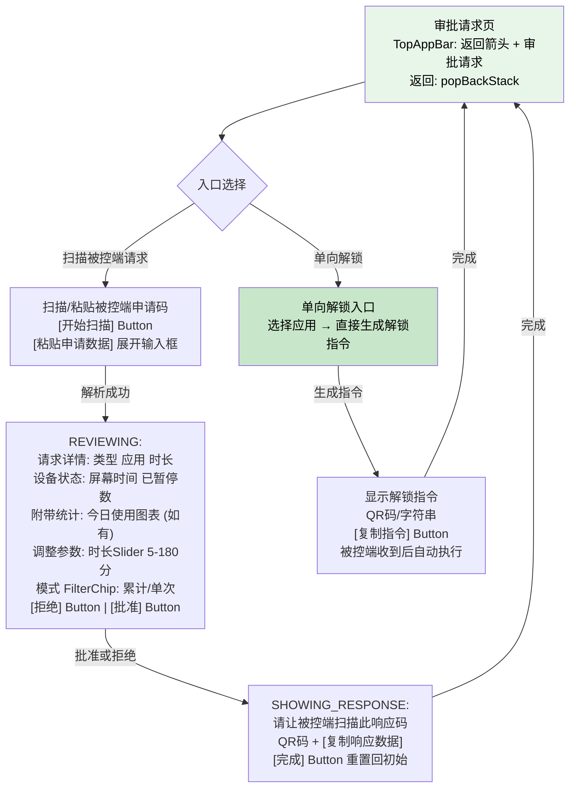

---

## 9. 单向控制流程（管控端 → 被控端）

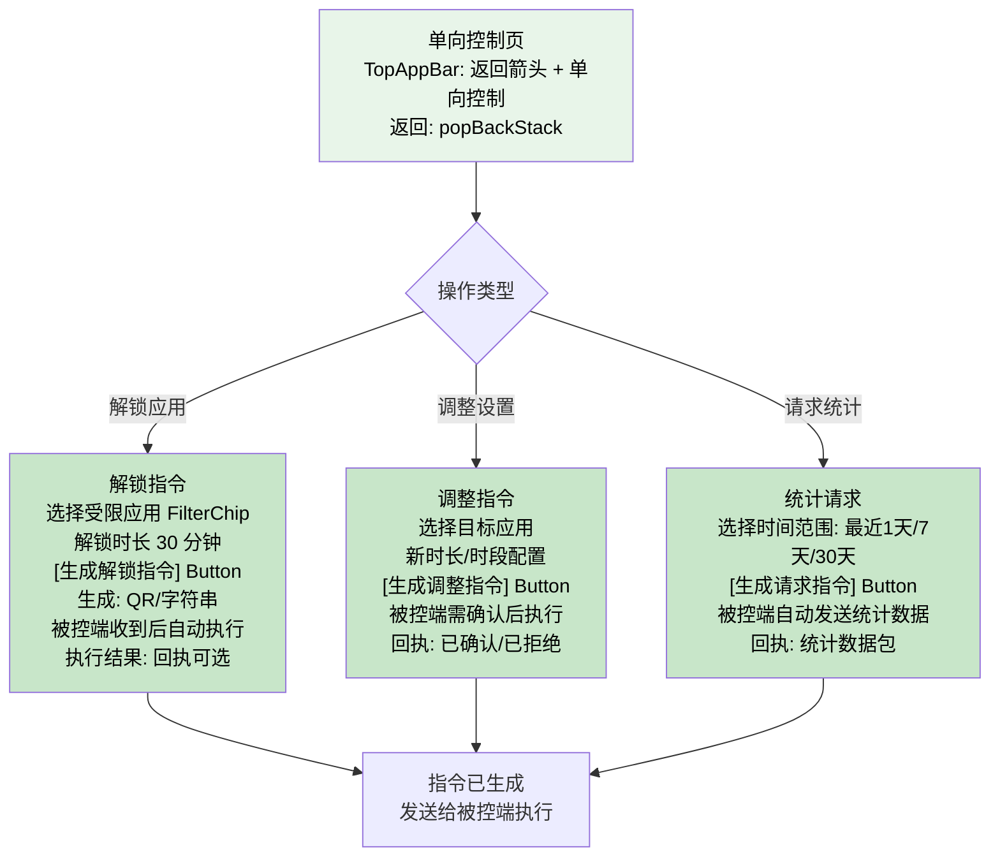

---

## 10. 申请解绑流程（被控端发起 → 管控端终止码确认）

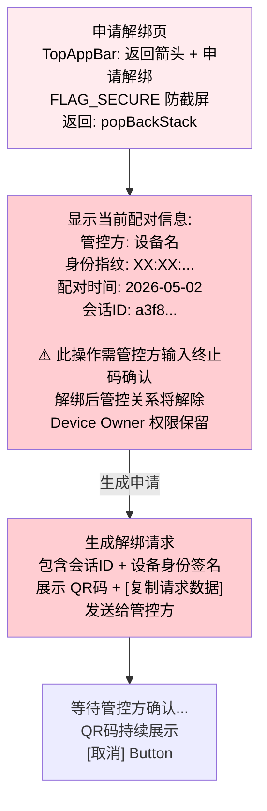

**管控端处理申请解绑（在审批请求页）：**
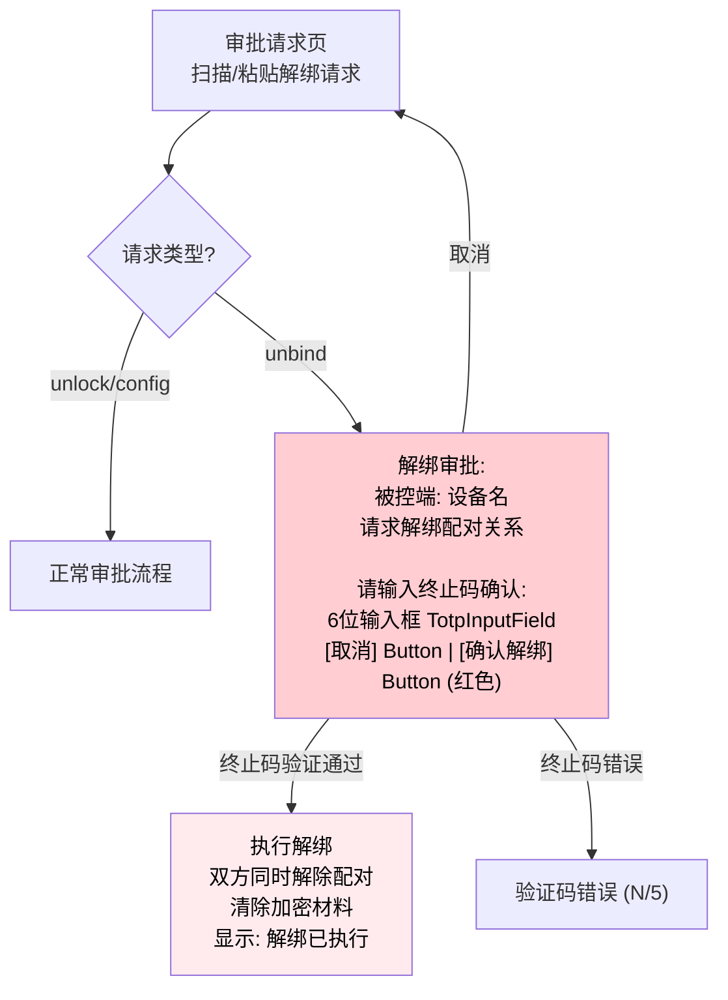

---

## 11. 设置页完整结构

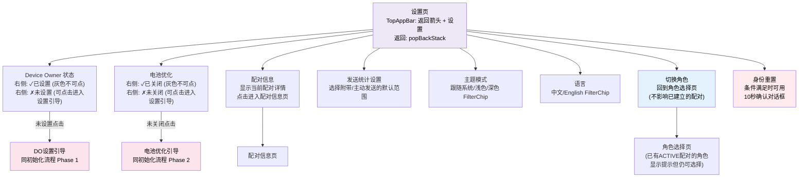

---

## 12. 配对信息页

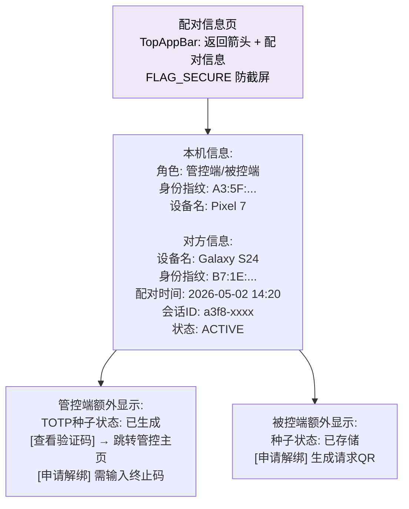

---

## 13. 紧急逃生页（管控端）

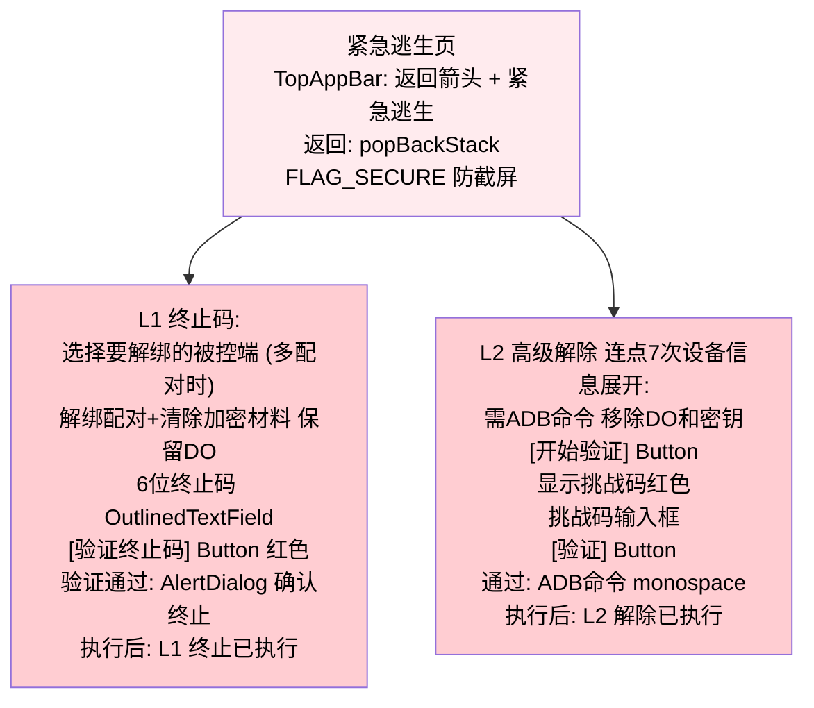

---

## 14. 完整页面流转表

| 从页面 | 触发操作 | 目标页面 | 可返回 |
|--------|---------|---------|--------|
| App 启动(未配对) | -- | 角色选择页 | -- |
| App 启动(已配对+管控端) | -- | 设备选择页 | -- |
| App 启动(已配对+被控端) | -- | 被控端主页 | -- |
| 角色选择 | 我要管控对方 | 配对页(controller) | 可 |
| 角色选择 | 我需要被管控 | DO设置页 | 可 |
| 角色选择 | 被控端有ACTIVE配对 | 提示已管控+申请解绑 | 可 |
| DO设置 Phase1 | 继续/跳过 | Phase2 电池优化 | 可 |
| DO设置 Phase2 | 完成/跳过 | 配对页(controlled) | 否(清栈) |
| DO设置 | 返回 | 角色选择页 | -- |
| 配对页 | 回执验证通过 | 配对确认页 | 可 |
| 配对确认页 | 确认(5s后) | 设备选择页/被控端主页 | 否(清栈) |
| 配对确认页 | 取消 | 配对页 | 可 |
| 设备选择页 | 点击设备 | 管控端主页 | 可 |
| 设备选择页 | 添加新设备 | 配对页(controller) | 可 |
| 设备选择页 | 设置图标 | 设置页 | 可 |
| 管控端主页 | 审批请求 | 审批请求页 | 可 |
| 管控端主页 | 紧急逃生 | 紧急逃生页 | 可 |
| 管控端主页 | 使用统计 | 使用统计页 | 可 |
| 管控端主页 | 单向控制 | 单向控制页 | 可 |
| 管控端主页 | 返回 | 设备选择页 | -- |
| 管控端主页 | 设置图标 | 设置页 | 可 |
| 被控端主页 | 应用卡片 | 申请解锁页 | 可 |
| 被控端主页 | 使用统计 | 使用统计页 | 可 |
| 被控端主页 | 发送统计 | 发送统计页 | 可 |
| 被控端主页 | 申请解绑 | 申请解绑页 | 可 |
| 被控端主页 | 设置图标 | 设置页 | 可 |
| 审批请求页 | 扫描/粘贴请求 | 审批详情 | -- |
| 审批请求页 | 扫描解绑请求 | 解绑审批(终止码) | 可 |
| 申请解绑页 | 生成请求 | 展示QR等待确认 | 可 |
| 申请解绑页 | 取消 | 被控端主页 | -- |
| 设置页 | DO状态(未设置) | DO设置引导 | 可 |
| 设置页 | 电池优化(未关闭) | 电池优化引导 | 可 |
| 设置页 | 配对信息 | 配对信息页 | 可 |
| 设置页 | 切换角色 | 角色选择页 | 可 |
| 所有子页 | 返回 | 上级页面 | -- |

---

## 15. 安全检查点汇总

| 检查点 | 位置 | 逻辑 |
|--------|------|------|
| 被控端已绑定检查 | 角色选择 → 我需要被管控 | 有 ACTIVE 配对则阻止，引导申请解绑 |
| 配对确认冷却 | 配对确认页 | 确认按钮 5 秒灰色不可点 |
| 终止码验证 | 紧急逃生 L1 / 解绑审批 | 6位TOTP + 5次错误锁30秒 |
| 挑战码验证 | 紧急逃生 L2 | 手动输入挑战码 |
| nonce 格式校验 | EmergencyUnlockReceiver | 16位hex正则校验 |
| FLAG_SECURE | 紧急逃生页 + 申请解绑页 + 配对信息页 | 防截屏 |
| 信封时效 | 所有签名信封 | 5分钟过期 |
| 频率限制 | 解锁/配置/解绑请求 | 30秒1次 |
