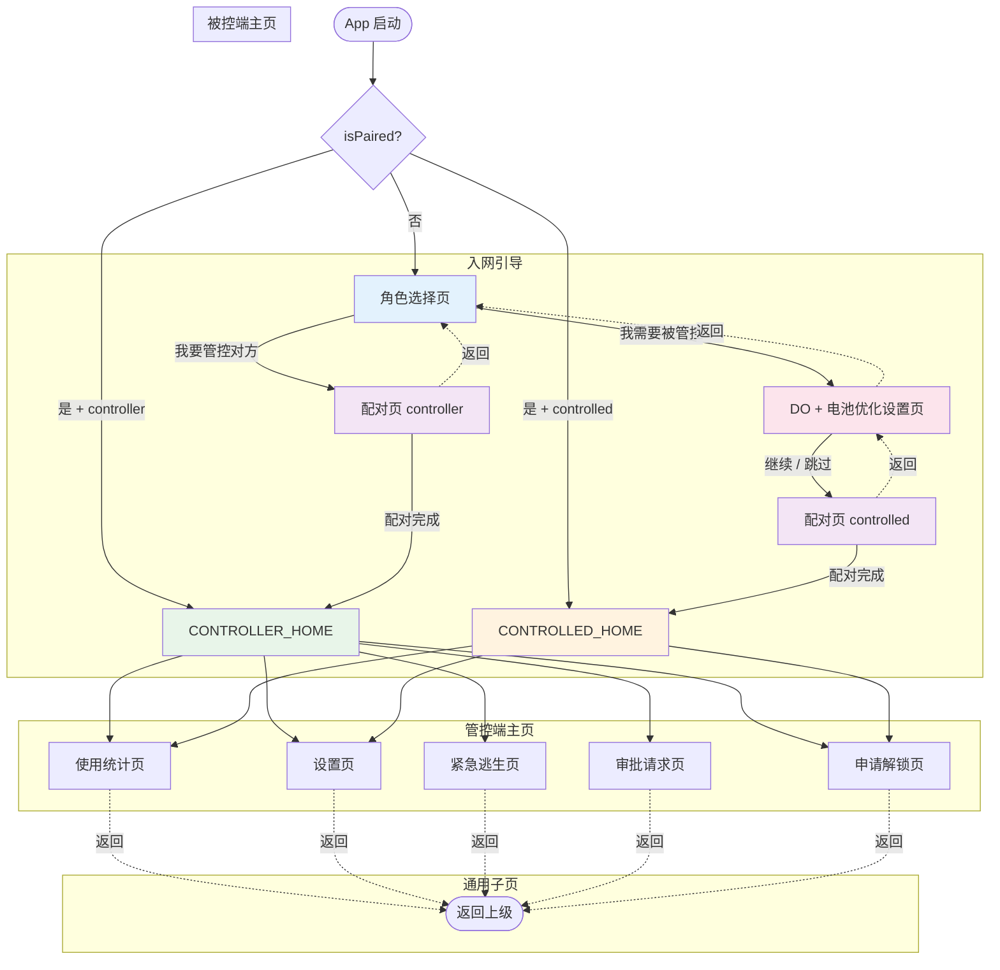

# PeerLock UI 导航流程图

## 启动逻辑

## 各页面功能说明

### 入网引导阶段

| 页面 | TopAppBar | 功能 |
|------|-----------|------|
| 角色选择页 | 无 | 两个按钮：管控方 / 被控方 |
| DO + 电池优化设置页 | 有返回箭头 | DO 状态检查、无线 ADB 引导、电池优化白名单 |
| 配对页 | 有返回箭头 | QR 码展示/扫描 + 字符串复制/粘贴 |

### 管控端

| 页面 | TopAppBar | 功能 |
|------|-----------|------|
| 管控端主页 | 设置图标 | TOTP 验证码、策略列表、审批/逃生/统计入口 |
| 审批请求页 | 有返回箭头 | 扫描被控端请求 QR → 审批/拒绝 → 生成响应 QR |
| 紧急逃生页 | 有返回箭头 | L1 终止码 / L2 ADB 解除 / L3 文档 |

### 被控端

| 页面 | TopAppBar | 功能 |
|------|-----------|------|
| 被控端主页 | 设置图标 | 受限应用列表、申请解锁入口 |
| 申请解锁页 | 有返回箭头 | 快速码模式（直接输入 TOTP）+ 申请模式（选应用 + 生成 QR） |

### 通用

| 页面 | TopAppBar | 功能 |
|------|-----------|------|
| 使用统计页 | 有返回箭头 | 小时柱状图、日折线图、点击下钻 |
| 设置页 | 有返回箭头 | 主题切换、语言切换 |
