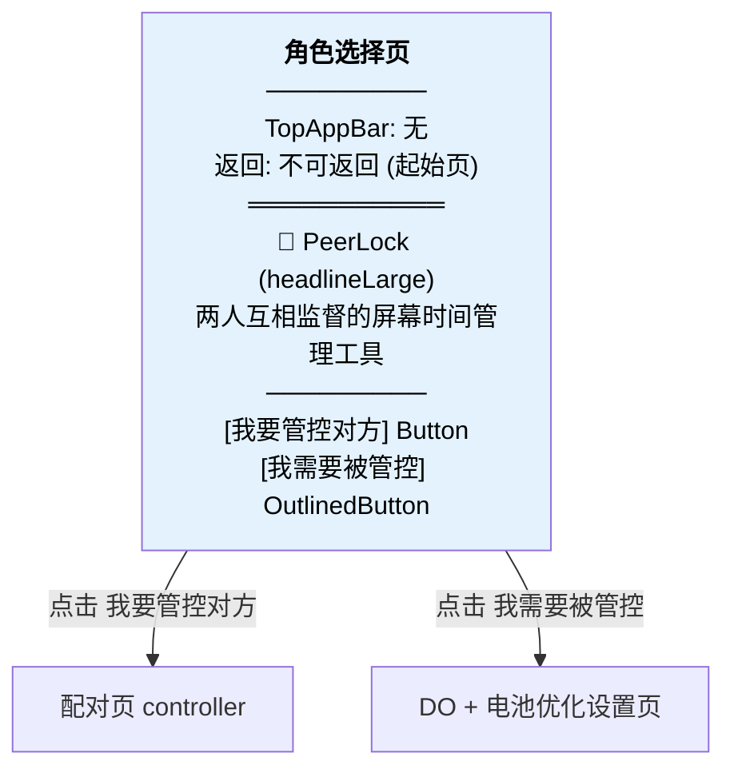

# PeerLock 各页面详细 UI 流程图

> 配合 [ui-navigation-flow.md](ui-navigation-flow.md) 总览图使用

---

## 1. 角色选择页 (RoleSelectionScreen)



---

## 2. DO + 电池优化设置页 (DeviceOwnerSetupScreen)

分两个阶段：Phase 1 = DO 设置，Phase 2 = 电池优化

### Phase 1: DO_SETUP

```mermaid
flowchart TD
    DO1["`**Phase 1: 设置 Device Owner**
    TopAppBar: ← 返回 + "设置 Device Owner"
    返回: popBackStack → 角色选择页
    ═══════════`"] --> DO_CHECK{isDeviceOwner?}

    DO_CHECK -->|是| DO_ALREADY["`✅ Device Owner 已设置
    [继续] Button`"]

    DO_CHECK -->|否| DO_NOT_YET["`说明: PeerLock 需要 DO 权限才能限制应用
    ─────────
    **无线 ADB (Android 11+)**
    [使用无线ADB配对(无需电脑)] OutlinedButton
      → 展开 6 步文字说明
      → adb 命令 (monospace)
      → [复制命令] Button
      → [收起] OutlinedButton
    ─────────
    **USB ADB (默认)**
    adb 命令 (monospace)
    [复制命令] Button
    ─────────
    [检查设置状态] Button
      └ 结果反馈 (statusMessage):
        · 未设置 → "DO 未设置，请先在电脑上执行命令" (红色)
        · 已设置 → 无提示，按钮区切换为 ✅
    ─────────
    [跳过(功能受限)] OutlinedButton`"]

    DO_ALREADY --> DO_ADVANCE["advanceToDoComplete()"]
    DO_ADVANCE --> DO_BATTERY_CHECK{isBatteryExempt?}
    DO_BATTERY_CHECK -->|是| DO_MARK["标记完成 → 进入 Phase 2"]
    DO_BATTERY_CHECK -->|否| PHASE2

    DO_NOT_YET --> DO_NOT_YET

    style DO1 fill:#FCE4EC,color:#000
```

### Phase 2: BATTERY_OPTIMIZATION

```mermaid
flowchart TD
    DO2["`**Phase 2: 电池优化白名单**
    TopAppBar: ← 返回 + "电池优化白名单"
    返回: popBackStack → 角色选择页
    ═══════════`"] --> BO_CHECK{isBatteryExempt?}

    BO_CHECK -->|是| BO_DONE["`✅ 已关闭电池优化
    说明: PeerLock 后台巡检可以正常运行
    [继续] Button → navigate 配对页(controlled)`"]

    BO_CHECK -->|否| BO_NOT["`说明: 需关闭电池优化才能保持巡检
    ─────────
    [关闭电池优化] Button → 系统对话框
    ─────────
    (requested后)
    提示: 请在弹出的系统对话框中点击允许
    [检查是否已关闭] OutlinedButton → 重新检测
    ─────────
    [跳过(后台巡检可能不稳定)] OutlinedButton`"]

    BO_NOT -->|跳过| NAV_PAIRING["navigate → 配对页(controlled)"]
    BO_NOT -->|关闭成功| NAV_PAIRING
    BO_DONE --> NAV_PAIRING

    style DO2 fill:#FCE4EC,color:#000
```

---

## 3. 配对页 (PairingScreen)

### 3a. 被控端视角 (role=controlled)

```mermaid
flowchart TD
    P1["`**配对页 — 被控端**
    TopAppBar: ← 返回 + "配对"
    返回: popBackStack → DO设置页`"] --> P1_STEP

    subgraph step1[Step: SHOW_MY_QR]
        P1_SHOW["`提示: 请让控制方扫描此二维码
        ─────────
        [QR码] pairRequestQr
        [复制配对数据] OutlinedButton → 剪贴板
        ─────────
        提示: 扫描完成后，请扫描控制方显示的响应码
        [扫描响应码] OutlinedButton → 相机`"]
    end

    subgraph step2[Step: SCAN_PEER_QR]
        P1_SCAN["`提示: 请扫描控制方的响应码
        [扫描响应码] OutlinedButton → 相机
        ─────────
        [粘贴响应数据] OutlinedButton
          → 展开 OutlinedTextField
          → [确认] Button`"]
    end

    subgraph step3[Step: COMPLETED]
        P1_DONE["`✅ 配对完成！
        [进入主页] Button → navigate 被控端主页 (清栈)`"]
    end

    P1_STEP --> P1_SHOW
    P1_SHOW -->|扫描/粘贴响应码| P1_SCAN
    P1_SCAN -->|验证通过| P1_DONE
    P1_SHOW -.->|返回| DO_PAGE[DO设置页]
    P1_SCAN -.->|返回| P1_SHOW

    style P1 fill:#F3E5F5,color:#000
    style step1 fill:#EDE7F6,color:#000
    style step2 fill:#EDE7F6,color:#000
    style step3 fill:#EDE7F6,color:#000
```

### 3b. 管控端视角 (role=controller)

```mermaid
flowchart TD
    P2["`**配对页 — 管控端**
    TopAppBar: ← 返回 + "配对"
    返回: popBackStack → 角色选择页`"] --> P2_STEP

    subgraph step1c[Step: SHOW_MY_QR]
        P2_SHOW["`提示: 请扫描被控端的二维码
        [扫描二维码] OutlinedButton → 相机
        ─────────
        [粘贴配对数据] OutlinedButton
          → 展开 OutlinedTextField
          → [确认] Button`"]
    end

    subgraph step2c[Step: SCAN_PEER_QR]
        P2_RESP["`提示: 请让被控端扫描此响应码
        ─────────
        [QR码] pairResponseQr
        [复制响应数据] OutlinedButton → 剪贴板`"]
    end

    subgraph step3c[Step: COMPLETED]
        P2_DONE["`✅ 配对完成！
        [进入主页] Button → navigate 管控端主页 (清栈)`"]
    end

    P2_STEP --> P2_SHOW
    P2_SHOW -->|扫描/粘贴被控端QR| P2_RESP
    P2_RESP -->|被控端扫码后自动完成| P2_DONE
    P2_SHOW -.->|返回| ROLE[角色选择页]
    P2_RESP -.->|返回| P2_SHOW

    style P2 fill:#F3E5F5,color:#000
    style step1c fill:#EDE7F6,color:#000
    style step2c fill:#EDE7F6,color:#000
    style step3c fill:#EDE7F6,color:#000
```

---

## 4. 管控端主页 (ControllerHomeScreen)

```mermaid
flowchart TD
    CH["`**管控端主页**
    TopAppBar: "PeerLock 控制端" + ⚙设置图标
    返回: 无 (顶级页)
    ═══════════
    📋 StatusCard: 🔒 已配对 / 策略巡检运行中
    ─────────
    [审批请求] Button
    [紧急逃生] OutlinedButton
    [使用统计] OutlinedButton
    ─────────
    **验证码** (每秒刷新)
    · 管理码: 123 456 — 25s
    · 解锁码: 654 321 — 18s
    · 终止码: 111 111 — 8s (≤5s 红色)
    ─────────
    **策略列表**
    · com.app1 / 每日60分 / 黑名单
    · com.app2 / 每日30分 / 白名单`"]

    CH -->|⚙| SETTINGS[设置页]
    CH -->|审批请求| RA[审批请求页]
    CH -->|紧急逃生| EM[紧急逃生页]
    CH -->|使用统计| ST[使用统计页]

    style CH fill:#E8F5E9,color:#000
```

---

## 5. 被控端主页 (ControlledHomeScreen)

```mermaid
flowchart TD
    CDH["`**被控端主页**
    TopAppBar: "PeerLock 被控端" + ⚙设置图标
    返回: 无 (顶级页)
    ═══════════
    📋 StatusCard: 📱 已配对 / 接受控制方管理
    ─────────
    **受限应用**
    · ⚠ com.app1 / 每日60分 → 点击
    · ⚠ com.app2 / 每日30分 → 点击
    · (空) 暂无限制
    ─────────
    [使用统计] OutlinedButton`"]

    CDH -->|⚙| SETTINGS[设置页]
    CDH -->|点击应用卡片| UR[申请解锁页]
    CDH -->|使用统计| ST[使用统计页]

    style CDH fill:#FFF3E0,color:#000
```

---

## 6. 申请解锁页 (UnlockRequestScreen) — 被控端

```mermaid
flowchart TD
    UR["`**申请解锁页**
    TopAppBar: ← 返回 + "申请解锁"
    返回: popBackStack`"] --> UR_MODE{模式切换}

    UR_MODE -->|默认| QUICK
    UR_MODE -->|切换| REQUEST

    subgraph quick[快速码模式]
        QUICK["`提示: 输入控制方提供的6位解锁码
        副标题: 将解锁所有受限应用
        ─────────
        ⬚ ⬚ ⬚ ⬚ ⬚ ⬚  TotpInputField (6位)
        ─────────
        解锁时长: [30] OutlinedTextField
        ─────────
        [切换到申请模式(选应用+扫码)] OutlinedButton
        ─────────
        (成功后)
        ✅ 已解锁全部受限应用，30分钟后自动暂停
        [完成] Button`"]
    end

    subgraph request[申请模式]
        REQUEST["`提示: 选择要解锁的应用
        ─────────
        ⚪ com.app1  FilterChip
        🔵 com.app2  FilterChip (选中)
        ─────────
        请求时长: [30] OutlinedTextField
        [生成申请码] Button (需选中应用)
        ─────────
        (生成后)
        请让控制方扫描此二维码
        [QR码]
        ─────────
        [切换到快速码模式] OutlinedButton`"]
    end

    style UR fill:#FFF3E0,color:#000
    style quick fill:#FFE0B2,color:#000
    style request fill:#FFE0B2,color:#000
```

---

## 7. 审批请求页 (RequestApprovalScreen) — 管控端

```mermaid
flowchart TD
    RA["`**审批请求页**
    TopAppBar: ← 返回 + "审批请求"
    返回: popBackStack (重置流程)`"] --> RA_STEPS

    subgraph idle[Step: IDLE]
        RA_IDLE["`提示: 扫描被控端的请求二维码
        [开始扫描] Button → 相机`"]
    end

    subgraph reviewing[Step: REVIEWING]
        RA_REVIEW["`📋 请求详情 Card
        ├ 类型: unlock
        ├ 应用: com.app1
        ├ 请求时长: 30分钟
        ─────────
        📋 设备状态 Card
        ├ 今日屏幕时间: 120分钟
        ├ 已暂停应用: 2个
        ─────────
        📋 调整解锁参数 Card
        ├ 时长: ═══●═══ Slider (5~180分)
        ├ 模式: [累计] [单次] FilterChip
        ─────────
        [拒绝] OutlinedButton | [批准] Button`"]
    end

    subgraph response[Step: SHOWING_RESPONSE]
        RA_RESP["`提示: 请让被控端扫描此响应码
        [QR码]
        [完成] Button → 重置回 IDLE`"]
    end

    RA_STEPS --> RA_IDLE
    RA_IDLE -->|扫描成功| RA_REVIEW
    RA_REVIEW -->|批准/拒绝| RA_RESP
    RA_RESP -->|完成| RA_IDLE

    style RA fill:#E8F5E9,color:#000
    style idle fill:#C8E6C9,color:#000
    style reviewing fill:#C8E6C9,color:#000
    style response fill:#C8E6C9,color:#000
```

---

## 8. 紧急逃生页 (EmergencyScreen) — 管控端

```mermaid
flowchart TD
    EM["`**紧急逃生页**
    TopAppBar: ← 返回 + "紧急逃生"
    返回: popBackStack
    ⚠ FLAG_SECURE 防截屏`"] --> EM_AREAS

    subgraph L1[L1 终止码]
        EM_L1["`L1 终止码
        说明: 解除配对 + 清除加密材料，保留 DO
        ─────────
        [6位终止码] OutlinedTextField
        [验证终止码] Button (红色)
        ─────────
        验证通过 → AlertDialog:
          "确认终止" / "确认终止(红)" / "取消"
        验证失败 → AlertDialog:
          "验证失败" / "确定"
        ─────────
        (执行后) ✅ L1 终止已执行`"]
    end

    subgraph L2[L2 高级解除 — 连点7次"设备信息"展开]
        EM_L2["`L2 高级解除
        说明: 需 ADB 命令，移除 DO 和密钥
        ─────────
        [开始验证] OutlinedButton
          → 挑战码: "a1b2c3d4" (红色)
          → [挑战码] OutlinedTextField
          → [验证] Button
            → 通过: ADB 命令 (monospace, 4行)
        ─────────
        (执行后) ✅ L2 解除已执行`"]
    end

    EM_AREAS --> EM_L1
    EM_AREAS --> EM_L2

    style EM fill:#FFEBEE,color:#000
    style L1 fill:#FFCDD2,color:#000
    style L2 fill:#FFCDD2,color:#000
```

---

## 9. 使用统计页 (StatsScreen) — 通用

```mermaid
flowchart TD
    ST["`**使用统计页**
    TopAppBar: ← 返回 + "使用统计"
    返回: popBackStack`"] --> ST_UI

    ST_UI["`[今天] [本周] [本月] FilterChip 标签
    ═══════════
    **小时柱状图** (Canvas, 今天标签)
    · X轴: 0~23时 / Y轴: 分钟
    · 点击柱子 → 下方显示该时段详情
    ─────────
    **日折线图** (Canvas, 本周/本月标签)
    · X轴: 日期 / Y轴: 分钟
    · 点击节点 → 下方显示当日详情
    ─────────
    **应用明细**
    · com.app1 — 120分 / 启动8次
    · com.app2 — 45分 / 启动3次`"]

    style ST fill:#E3F2FD,color:#000
```

---

## 10. 设置页 (SettingsScreen) — 通用

```mermaid
flowchart TD
    SET["`**设置页**
    TopAppBar: ← 返回 + "设置"
    返回: popBackStack`"] --> SET_UI

    SET_UI["`**主题模式**
    [跟随系统] [浅色] [深色] FilterChip
    ─────────
    **语言**
    [中文] [English] FilterChip`"]

    style SET fill:#EDE7F6,color:#000
```

---

## 完整页面流转表

| 从页面 | 触发操作 | 目标页面 | 可返回 |
|--------|---------|---------|--------|
| App 启动 (未配对) | — | 角色选择页 | — |
| App 启动 (已配对) | — | 对应主页 | — |
| 角色选择 | "我要管控对方" | 配对页(controller) | ✓ |
| 角色选择 | "我需要被管控" | DO设置页 | ✓ |
| DO设置 | 继续 / 跳过 | 配对页(controlled) | ✗ (清栈) |
| DO设置 | ← 返回 | 角色选择页 | — |
| 配对页(controller) | 配对完成 | 管控端主页 | ✗ (清栈) |
| 配对页(controller) | ← 返回 | 角色选择页 | — |
| 配对页(controlled) | 配对完成 | 被控端主页 | ✗ (清栈) |
| 配对页(controlled) | ← 返回 | DO设置页 | — |
| 管控端主页 | ⚙ | 设置页 | ✓ |
| 管控端主页 | 审批请求 | 审批请求页 | ✓ |
| 管控端主页 | 紧急逃生 | 紧急逃生页 | ✓ |
| 管控端主页 | 使用统计 | 使用统计页 | ✓ |
| 被控端主页 | ⚙ | 设置页 | ✓ |
| 被控端主页 | 应用卡片 | 申请解锁页 | ✓ |
| 被控端主页 | 使用统计 | 使用统计页 | ✓ |
| 所有子页 | ← 返回 | 上级页面 | — |
