# PeerLock 各页面详细 UI 流程图

> 配合 [ui-navigation-flow.md](ui-navigation-flow.md) 总览图使用

---

## 1. 角色选择页 (RoleSelectionScreen)

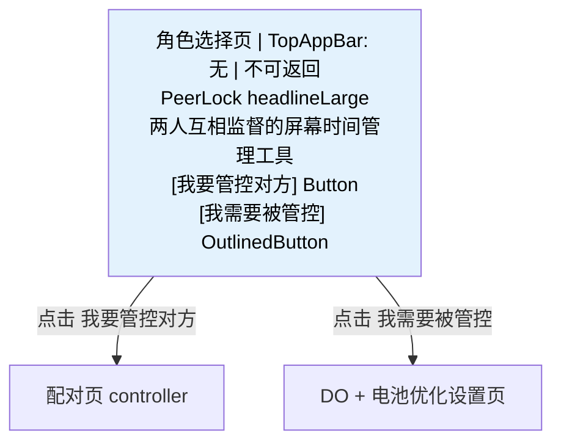

---

## 2. DO + 电池优化设置页 (DeviceOwnerSetupScreen)

分两个阶段：Phase 1 = DO 设置，Phase 2 = 电池优化

### Phase 1: DO_SETUP

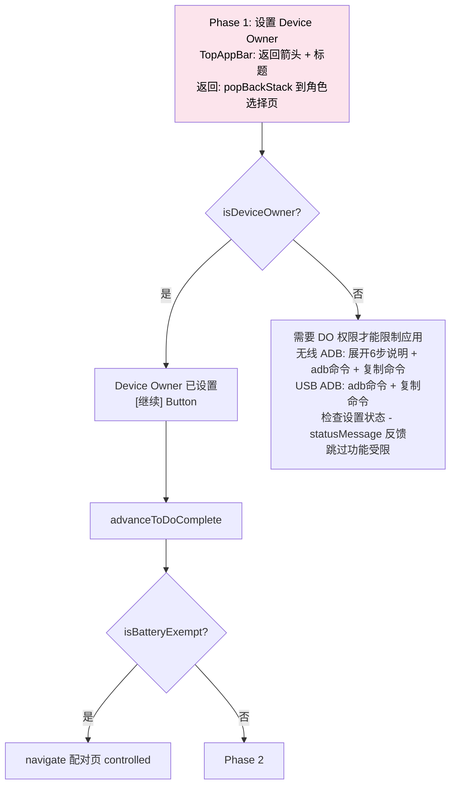

### Phase 2: BATTERY_OPTIMIZATION

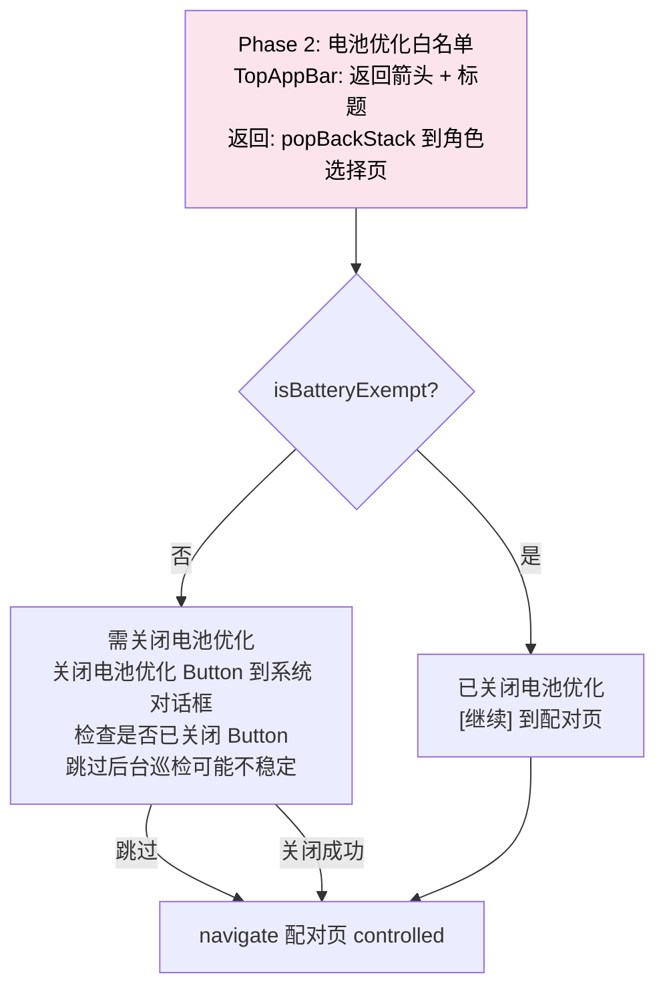

---

## 3. 配对页 (PairingScreen)

### 3a. 被控端视角 (role=controlled)

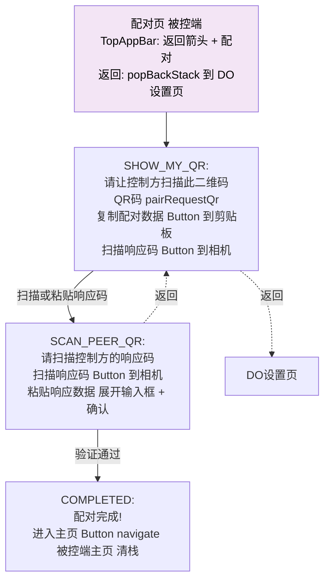

### 3b. 管控端视角 (role=controller)

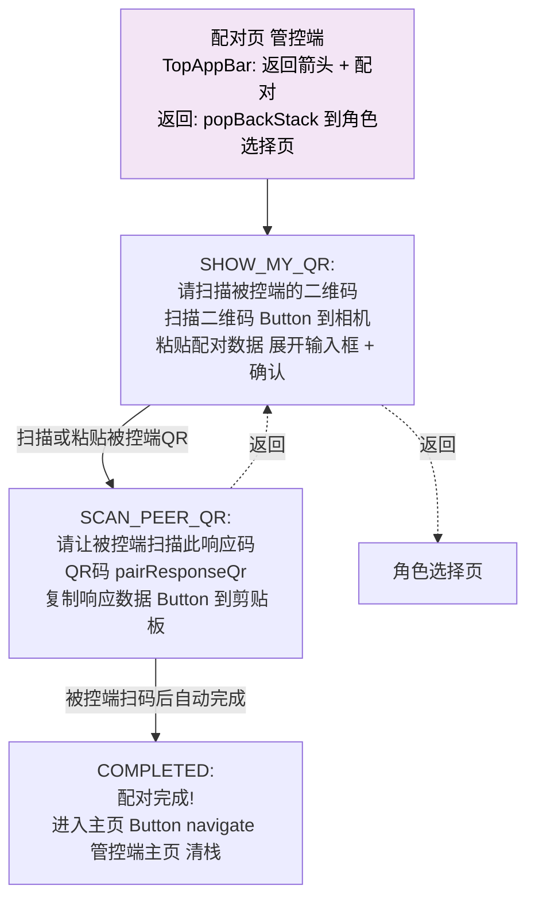

---

## 4. 管控端主页 (ControllerHomeScreen)

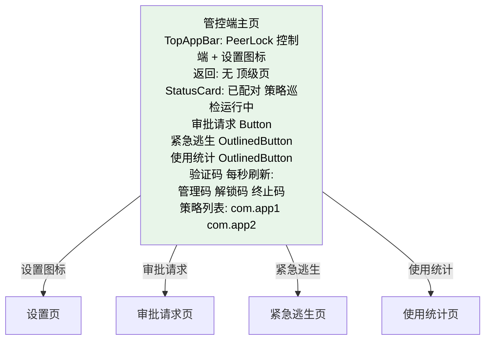

---

## 5. 被控端主页 (ControlledHomeScreen)

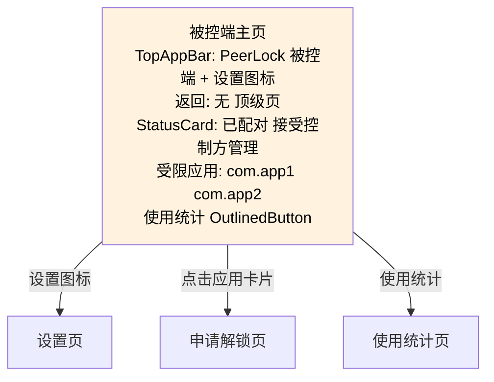

---

## 6. 申请解锁页 (UnlockRequestScreen) — 被控端

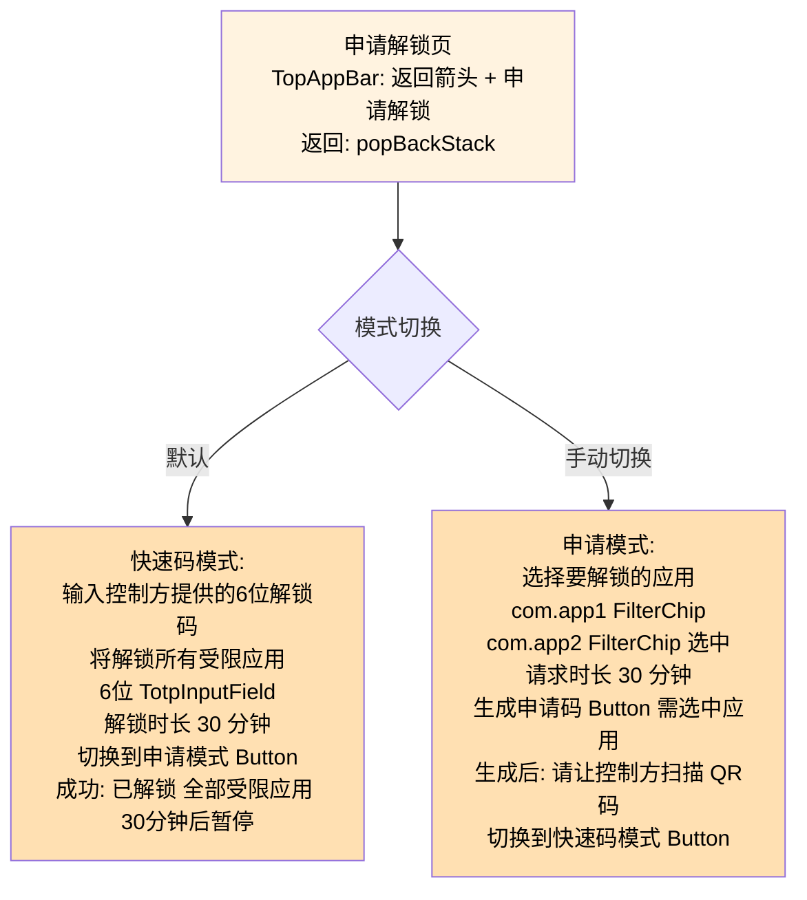

---

## 7. 审批请求页 (RequestApprovalScreen) — 管控端

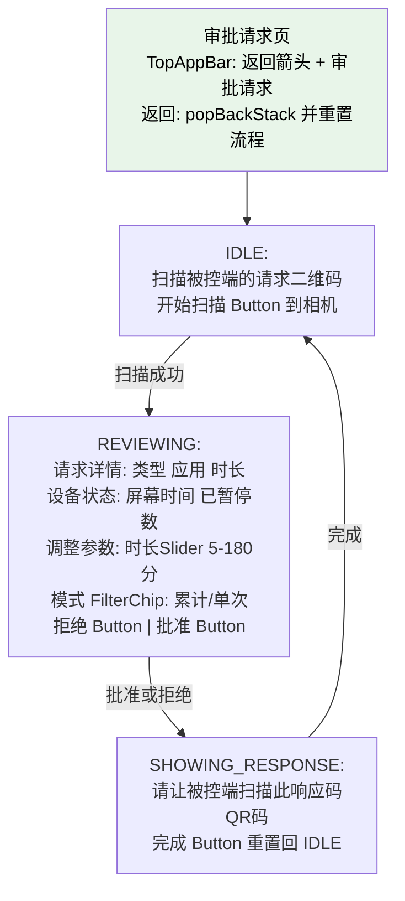

---

## 8. 紧急逃生页 (EmergencyScreen) — 管控端

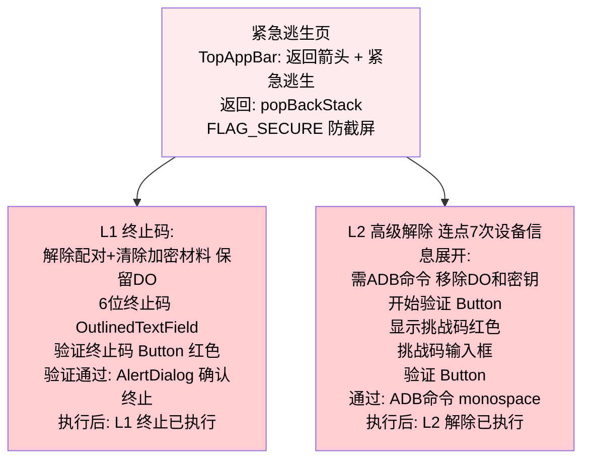

---

## 9. 使用统计页 (StatsScreen) — 通用

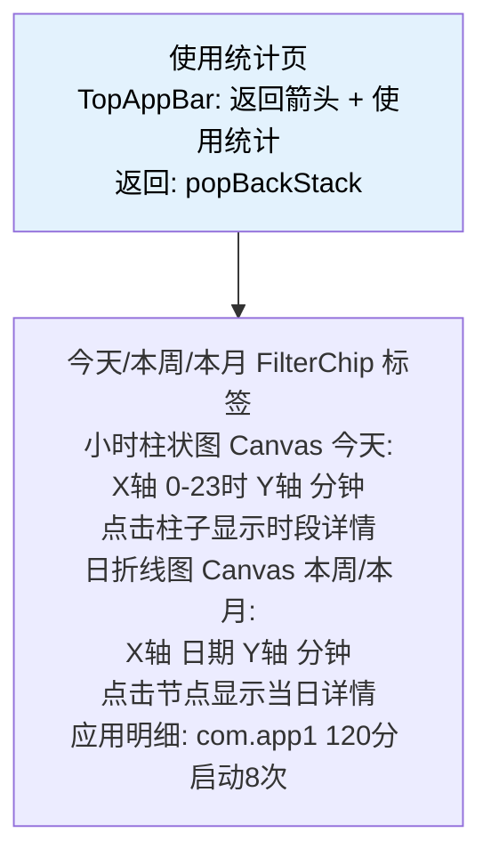

---

## 10. 设置页 (SettingsScreen) — 通用

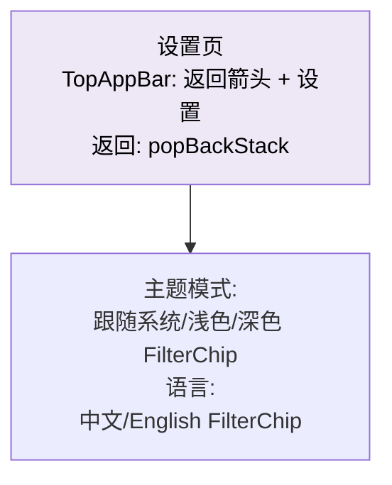

---

## 完整页面流转表

| 从页面 | 触发操作 | 目标页面 | 可返回 |
|--------|---------|---------|--------|
| App 启动(未配对) | -- | 角色选择页 | -- |
| App 启动(已配对) | -- | 对应主页 | -- |
| 角色选择 | 我要管控对方 | 配对页(controller) | 可 |
| 角色选择 | 我需要被管控 | DO设置页 | 可 |
| DO设置 | 继续/跳过 | 配对页(controlled) | 否(清栈) |
| DO设置 | 返回 | 角色选择页 | -- |
| 配对页(controller) | 配对完成 | 管控端主页 | 否(清栈) |
| 配对页(controller) | 返回 | 角色选择页 | -- |
| 配对页(controlled) | 配对完成 | 被控端主页 | 否(清栈) |
| 配对页(controlled) | 返回 | DO设置页 | -- |
| 管控端主页 | 设置图标 | 设置页 | 可 |
| 管控端主页 | 审批请求 | 审批请求页 | 可 |
| 管控端主页 | 紧急逃生 | 紧急逃生页 | 可 |
| 管控端主页 | 使用统计 | 使用统计页 | 可 |
| 被控端主页 | 设置图标 | 设置页 | 可 |
| 被控端主页 | 应用卡片 | 申请解锁页 | 可 |
| 被控端主页 | 使用统计 | 使用统计页 | 可 |
| 所有子页 | 返回 | 上级页面 | -- |
